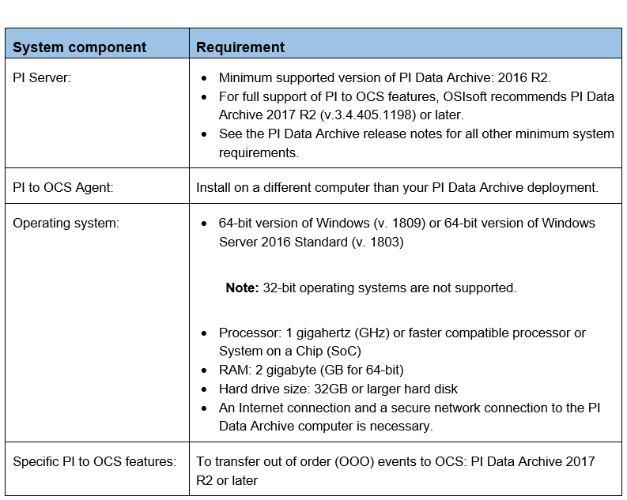

# Minimum system requirements

The following system requirements are required to transfer data from your on-premises PI Server to OCS using the PI to OCS Agent:

## Administrator privileges

The PI to OCS Agent must be installed on a local machine by a user account with the following permissions: 

1.	Administrator privileges on the local machine
2.	Assigned to the OCS Tenant Administrator role

During the PI to OCS Agent installation, you will be prompted to log on to the OCS portal. 

Note: Log on to OCS with the correct Tenant Administrator credentials. 

The PI to OCS Agent requires the Windows service to "run as user". You must have read access to the following data on PI Data Archive:

* Archive data (the PIARCDATA Security table)
* The PI points configuration table (PIPOINT Security table)
* The PI points and data to be transferred