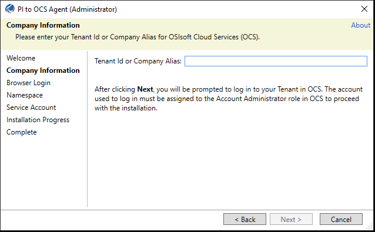
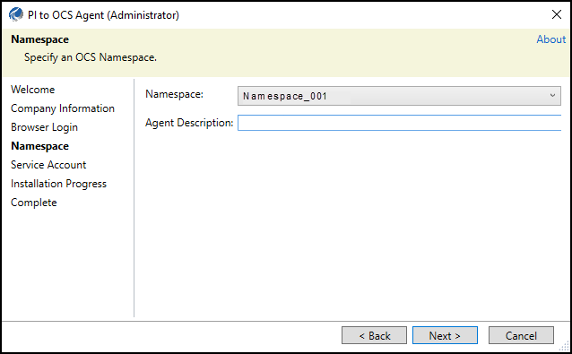
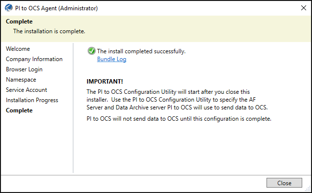
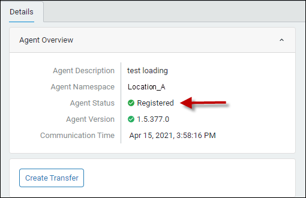

# PI to OCS Agent

Follow these guidelines to install the PI to OCS Agent:

* Install the agent on a host computer separate from your PI Data Archive deployment
* Use an account that has been granted Administrator privileges

You can download the PI to OCS Agent Installation kit and then transfer it to the computer that will host the agent.

Note: The PI to OCS Agent installation cannot be completed if the system time is not correct. Additionally, you will not be able to complete the PI to OCS Agent installation if Internet Explorer Enhanced Security configuration is enabled. Please see the [Disable Internet Explorer Enhanced Security Configuration](xref:disable-ie-security) topic for details. 

## Topics in this section

This topic contains these subtopics:

* [Install the PI to OCS Agent](#install-the-pi-to-ocs-agent)

* [Verify the PI to OCS Agent is running and registered](#verify-the-pi-to-ocs-agent-is-running-and-registered)

## Install the PI to OCS Agent

### Procedure

1. In the OCS portal, click the  icon, then click **PI to OCS Agents** (under Data Collection).

2. Click **Download Agent** to open the `Agent Installer` window.

3. Select the desired mirror location, **US** or **EU**.

   The `Save As` dialog box opens.

   Note: The mirror location you select does not determine where your data gets stored.

4. Download the agent to the desired location.

4. Close the Agent Installer window.

5. Navigate to the downloaded PI to OCS agent installation file.

6. Right-click the PI to OCS agent installation file, then click **Run as administrator**.

8. Click **Yes**.

   The Welcome page opens.
   
  

9. Click **Next**.

   The Company Information page opens.

	
10. Enter your OCS tenant ID or company alias in the **Tenant ID or Company Alias** text box, then click **Next**.
    
    Note: After clicking **Next**, you are prompted to log on to your tenant in OCS.  The account used to log on must be assigned to the OCS Tenant Administrator role to complete the PI to OCS Agent installation.<!--Test to confirm the wording is "account" not "tenant".--> 
    
    The PI to OCS Agent setup kit advances to the Browser Login page. An OCS message opens in your web browser regarding the status of the user authentication process. 
    
11. Close the browser window.

12. Click **Next** in the Company Information page. 

    The Namespace page opens.

13. Select or enter the following information for your PI to OCS connection:

    - **Namespace**: Select the location where your transferred data will be stored. The region indicates where the namespace resides. Streaming data sent by the PI to OCS Agent only goes to the selected namespace's region.
    
    - **Agent Description:** Enter an optional descriptive name for your agent that is easy to identify.

14. Click **Next**.

    The Service Account page opens.

15. Select the service account type for the connection:

    * **NT Service**: Use an NT account to connect to PI Data Archive.
    * **This account**: Specify a user name and password (domain\account) to connect to PI Data Archive.

    Note: The service account must have Administrator privileges and read access to certain data on PI Data Archive.

16. Click **Install**.

    The PI to OCS Agent is installed. 

    Note: Installation may take a few moments.

    
    

17. Click **Close** to close the PI to OCS Agent wizard and open the PI to OCS Configuration Utility.

    The PI to OCS Configuration Utility opens. See [Use the PI to OCS Agent Configuration Utility](xref:pi-to-ocs-utility) for instructions.
    
    Note: An agent cannot be registered until a PI Data Archive server has been configured using the utility.

## Verify the PI to OCS Agent is running and registered

After installation, check that the PI to OCS Agent Windows service is running on the machine where the agent is installed. You also should confirm the agent has been registered in OCS. <!--Do we even need this topic here if the agent does not register until the user has configured and connected to an AF server or PIDA?-->

#### Procedure

1. On the host machine where you installed the agent, type *services.msc* in the text box next to the Windows menu button, then press ENTER.

2. In the `Services` window, scroll to and verify that that the PI to OCS Agent’s status is running.

3. Navigate to the `PI to OCS Agents` window in OCS, then select the connection you just created. 

4. On the `Details` pane, Verify that **Registered** appears next to the **Agent Status** field.

   Note: The agent status is also displayed in the PI to OCS Configuration Utility.  See [List of agent status states](xref:pi-to-ocs-utility) to see why an agent may not be running.