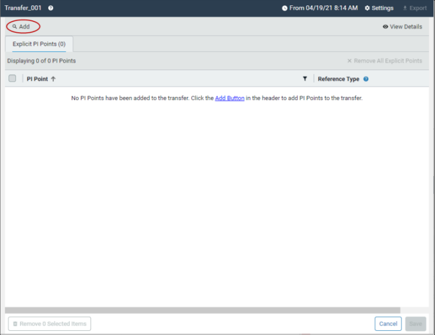
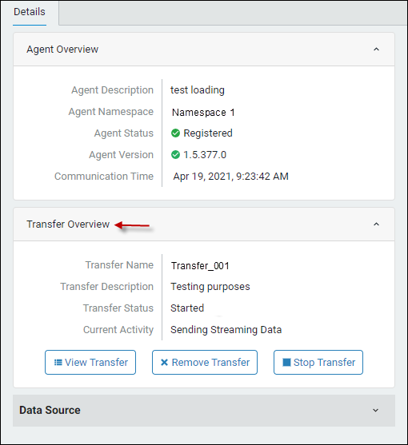

# Transfer PI System data to OCS

To transfer PI points into OCS, you must first define transfer settings and then build a PI points transfer table. The data transfer process consists of the following steps:

* [Create a transfer](#create-a-transfer)
* [Overview of the PI Points Search pane](#overview-of-the-pi-points-search-pane)
* [Build a PI points transfer list](#build-a-pi-points-transfer-list)
* [View PI point details](#view-pi-point-details)
* [Remove PI points from a transfer](#remove-pi-points-from-a-transfer)
* [Save a transfer and start transferring data to OCS](#save-a-transfer-and-start-transferring-data-to-ocs) 

### Create a transfer

You create a transfer to have a placeholder to store the PI point data you wish to transfer.

#### Before you start

Download and install the PI to OCS agent. Register your PI Data Archive with the PI to OCS Agent Configuration Utility.

#### Procedure

1. Log on to the [OCS portal](https://cloud.osisoft.com).

2. Click the menu  icon, then click **PI to OCS Agents** (under Data Collection).

3. In the `PI to OCS Agents` window, select an agent for the data transfer.

4. Click the **Create Transfer** button in the Details pane to open the Transfer Settings dialog box.
 

5. Enter a name and description for the transfer.

6. Optional: In the **Historical Start time** fields, enter a [historical time context](xref:overview-data-transfers) for the data retrieval. 

   NOTE: OCS supports out of order events and stores data in chronological order by timestamp. PI Data Archive 2017 SP2 or higher is required for this feature. Enter the historical start date and time correctly to ensure all data is included in the transfer. No data before the historical start time will be captured and stored in SDS.

7. Click **Ok**.

   The new transfer opens in the PI to OCS Agents window.

### Overview of the PI Points Search pane

You build a PI points transfer list in the PI Points Search pane. To open this pane, click the Add button in the Transfer window.  You define search criteria to filter which PI points are returned in the query results.

​	
No. | Use to ... 
---------|----------
1   | Hide or reveal the Search Criteria panel  
2 | Filter by PI point name   
3 | Filter by PI point source  
4 | Filter by PI point description 
5 | Filter by a specific engineering unit (gallons, temperature, etc.) 
6 | Filter by PI point type (Float32, Float 64, Int16, Int32, Digital, Timestamp or String) 
7 | Filter by an additional extended description 
8 | Filter by location code value 
9 | Execute the query and return matching results. 
10| Quickly select all PI points returned by a query 
11| Navigate through search result pages.  
12| Add selected PI points to a transfer. 

### Build a PI points transfer list

You build a PI points transfer list to select which PI points you want in a data transfer. 

### Procedure

1. Click the **Add** button to open the Search pane on the left.
   
2. Define your search query by entering filter criteria:

| To... | Do this... | 
| ------------- | ----------------- | 
| Include common PI point attributes in a query | Enter criteria in any of the following fields:<ul><li>Name (alias for tag attribute).</li><li>Point Source</li></ul>Note: The search fields default to * or all PI points if search criteria is not ensured. |
| Include point descriptions in a query | Enter criteria in the following fields:<ul><li>Descriptor</li><li>Extended Descriptor</li></ul> |
| Include engineering units in a query | Enter criteria in the Engineering Units field. |
| Specify a specific PI point type for a query |Select one of the following point types from the Point Type drop-down list: <ul><li>Float32</li><li>Float64</li><li>Int16</li><li>Int32</li><li>Digital</li><li>Timestamp</li><li>String</li></ul> |
| Specify specific location code(s) for a query | Enter search criteria for PI tag attributes in the Location Codes fields (Location1, Location2, Location3, Location4, and/or Location5).  |

   TIP: Click the **Search Criteria** toggle arrow to hide or show search fields.

3. Click **Search** to execute the query and retrieve matching results.

   Search results are displayed in the Search Results list box.

4. Scroll through the PI points in the Search Results list and click each point you want in the data transfer.

   TIP: To select a range of PI points, click a PI point and then scroll to and [SHIFT+Click] a non-adjacent point. 

5. To advance through multiple-paged search results, click the back and forward arrows OR enter a page number in the **Page** text box.

6. Repeat steps 4-6 as needed until you have selected all the points for your data transfer.

7. When you are done selecting PI points, click the **Add PI Points To Transfer** button.

   The points are added to the transfer and listed in the Explicit PI Points pane.

​	NOTE: Once you are done adding PI points, you must save the transfer before you can start to transfer data to OCS.

### View PI point details

You can view attribute details for a PI point that has been added to a transfer.

### Procedure

1. Select a PI point on the Explicit PI Points tab.

2. Click  at the top right of the Transfer pane.

   Result: The PI Points Information pane opens to the right and the PI point's attributes are shown.
   

3. To view another PI point's details, click to unselect the selected PI point, then select the new point.

4. Click **x** to close the PI Point Information pane.

### Remove PI points from a transfer

You can remove unwanted PI points from a transfer prior to saving the transfer.

#### Procedure

1. On the Explicit PI Points tab, select the PI points you wish to remove in the `Explicit PI Points pane`.
2. Click the **Remove # Selected Items** button.

   

3. Click **Remove** again.

   The PI point are removed from the transfer.

   Note: To remove all the PI points from a transfer, click the **Remove All Explicit Points** button.

### Save a transfer and start transferring data to OCS

You can transfer data to OCS after you have finished adding PI points.  During a data transfer, events are sent asynchronously. Historical events are sent first, followed by current events.  The progress of a data transfer is displayed in the Details pane.  

#### Procedure

1. In the Explicit PI Points tab, click the **Save** button in the lower right corner of the window.

   The transfer is saved and you are returned to the `PI to OCS Agents` window.

2. Select the agent with the saved transfer.

3. In the `Details pane`, click the **Start Transfer** button, then click **Start**.

   The data transfer begins and the fields in the Transfer Overview section display the transfer's progress.
   

4. In the Details pane, click the Data Source down arrow to view more information about your transfer:

   * Server version: The version of the connected PI Data Archive
   * Last Streaming Read
   * Streaming Events Per Second: The number of streaming events being transferred
   * Historical Events Per Second: The number of historical events being transferred
   * Historical Transfer: Displays the percentage of completion for streamed historical events.
   * Historical start and end: The time range of past, historical events transferred to OCS 

5. Optional: Click the **Stop Transfer** button, then click **Stop** to stop the transfer of data to OCS.

6. Optional: Click the **Remove Transfer** button, then click **Remove** to delete the transfer completely.

