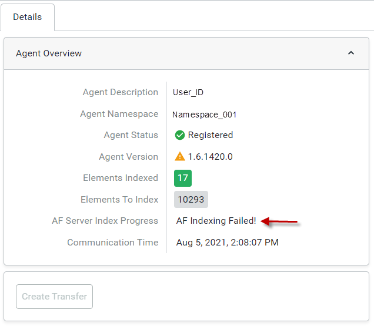

# Troubleshoot failed AF indexing

Immediately after PI to OCS Agent registration, AF indexing is initiated and then must finish successfully before a new transfer can be  defined. After registration, the PI to OCS Agent performs various tasks to prepare for the transfer process, including AF indexing, and testing Data Archive connections. The progress of AF indexing is displayed next to the **AF Server Index Progress** field on the **Agent Overview** pane, as shown in the image below.

If the  **"AF Indexing Failed!"** message appears next to this field, you must restart the PI to OCS Agent to reinitiate AF indexing using either of these methods:

* Restart the PI to OCS service.
* Reboot the host machine that the PI to OCS Agent runs on.

**Note:** It is possible for an agent to complete and indicate that indexing has completed, but still needs to re-index.  Additionally, there may be times when an agent appears to be working, but won't start a transfer. In both cases, OCS advises to restart the PI to OCS agent to initiate AF indexing.
