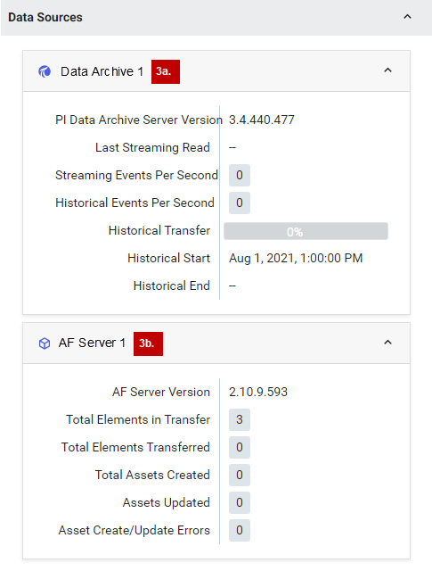

# Transfer data to OCS

You initiate a data transfer from the `PI to OCS Agents` window. A transfer can contain a combination of PI points and AF elements or just PI points or AF elements. The transfer of PI System data to OCS consists of the following procedures:

1. [Create a transfer](#create-a-transfer)

2. [Build an AF elements transfer list](#build-an-af-elements-transfer-list)

3. [View AF element details](#view-af-element-details)
4. [Build a PI points transfer list](#build-a-pi-points-transfer-list)
5. [Explicit vs. implicit PI points](#explicit-vs.-implicit-pi-points)

5. [View PI point details](#view-pi-point-details)

6. [Save a transfer](#save-a-transfer)

7. [Initiate a data transfer](#initiate-a-data-transfer)

#### Before you start

Download and install the PI to OCS Agent. Register your PI Data Archive and AF data sources using the PI to OCS Agent Configuration Utility. 

### Create a transfer

1. Sign in to the [OCS portal](https://cloud.osisoft.com).

2. Click the menu  icon, then click **Data Collection > PI to OCS Agents**.

4. In the `PI to OCS Agents` window, select the agent for the data transfer.

5. In the `Details` pane, click **Create Transfer**.
   **Result:** The **Transfer Setting** dialog box opens.

6. Enter a name and description for the transfer.

6. **Optional**: Enter a historical time context for the data retrieval in the **Historical Start time** fields.

   **NOTE:** OCS supports out of order events and stores data in chronological order by timestamp. PI Data Archive 2017 SP2 or higher is required for this feature. Be sure to enter the historical start date and time correctly to ensure all data is included in the transfer. No data before the historical start time will be captured and stored in SDS.

8. Click **Ok**.
   **Result:** The transfer is created and the `PI to OCS Agents` window opens.
   
   

## Build an AF elements transfer list

You build an AF elements transfer by setting query criteria and then selecting the desired AF elements.  You can narrow down your search by filtering AF elements by element name, as well as attribute name and/or value. 

1. Select your agent in the **PI to OCS Agents** list, then click the **Add** button.

   **Result:** The `AF Element Search` pane opens.

   

2. Click the **AF Database** down arrow, then select the source AF database for your query.

3. Click the **Root Asset** button, then select the root asset. <!--Get a clear definition of root asset. Is selecting an AF database and root asset mandatory?-->

### To filter by element name

4. In the **Element Name** text box, enter search criteria.

### To filter by attribute name and/or value

5. In the **Attribute Name** text box, enter the exact name of the attribute.<!--Is this correct or can you use the first few charcters + the * sign?-->

6. In the **Attribute Value** fields, selection an operator (=, <>, <, >, =<, =>, In) to restrict enter an attribute value or range to further refine query results.

7. **Optional:** Click the **Template** down arrow to narrow your search by template name.

8. **Optional: **Click the **Category** down arrow to narrow the search by a specific category.

9. Click **Search** to execute the query and retrieve matching results.
      **Result:** Query results are displayed in the **Search Results** list.

10. Scroll through the query results and click on each AF elements you want added to the transfer.

    **Result:** A checkmark appears next to each selected AF element.
    **Tip:** To select a range of elements, click an element and then scroll to and [SHIFT+Click] a non-adjacent element. 

11. To advance through multiple-paged query results, click the back and forward arrows OR enter a page number in the **Page** text box.

12. Repeat step 10 until you have finished selecting elements.

13. When you are done selecting elements, click **Add AF Elements To Transfer**.
    **Result:**  The elements are added to the transfer in the `AF Elements` tab.

14. Click **Save** to add the selected AF elements to the transfer.

    **Note:** You can continue adding AF elements after adding and saving a selection. AF Indexing needs to be completed before implicit PI points are loaded and you can start the transfer process.

## View AF element details

You can view details about the AF elements you have added to a transfer.

1. In the `Transfer` pane, click the **AF Elements** tab.
2. Select an AF element.
3. At the top right of the `Transfer` pane, click the **View Details** button.
   **Result:** Details for the selected AF element is shown.
4. To view details for another item, click a different element in the **AF Elements** list.
5. Repeat step 4 as needed.
6. Click the **View Details** button or **x** to close the panel.

## Build a PI points transfer list

You build a PI points transfer list by setting query criteria and then adding the desired PI points.  A PI points transfer list may contain both implicit and explicit PI points. See [Explicit vs. implicit PI points](#explicit-vs.-implicit-pi-points) for more information.

1. Click the **PI Point** **Search** tab.

   

2. Click the **Add** button.
   **Result:** The `Search` pane opens.

3. Define your search query:

   | **To specify...**          | **Do this...**                                               |
   | -------------------------- | ------------------------------------------------------------ |
   | Common PI point attributes | Enter criteria in any of the following fields: <ul><li>**Name** (alias for tag attribute)</li><li>**Point Source**</li></ul>  **Note:** The search fields default to * or all PI points if search criteria is not entered. |
   | Point descriptions         | Enter criteria in the following fields: <ul><li>**Descriptor** </li><li>**Extended Descriptor**</li></ul> |
   | Engineering units          | Enter criteria in the **Engineering Units** field.           |
   | A PI point type            | Select one of the following point types from the **Point Type** drop-down list: <ul><li>**Float32** </li><li>**Float64**</li><li>**Int16**</li><li>**Int32**</li><li>**Digital**</li><li>**Timestamp**</li><li>**String**</li></ul> |
   | Specific location code(s)  | Enter up to five location code values (1-9) in the **Location Codes** field. |

4. **Optional: **Click **Search Criteria** to collapse or expand the criteria pane.

5. Click **Search** to execute the query and retrieve matching results.

6. Scroll through the **Search Results** list box and click each PI point you want added to the data transfer.

   **Result:** A checkmark appears next to each selected PI point.

   **Tip:** To select a range of PI points, click a PI point and then scroll to and [SHIFT+Click] a non-adjacent PI point. 

7. To advance through multiple-paged query results, click the back and forward arrows OR enter a page number in the **Page** text box.

8. Repeat step 6 until you have finished selecting PI points.

9. When you are done selecting PI points, click **Add PI Points to Transfer**.
   **Result:**  The points are added to the transfer and appear on the `PI Points` tab.

## Explicit vs. implicit PI points

PI points added to a transfer are assigned one of these two reference types:

* Explicit
* Implicit

The reference type indicates the PI point's source and how it was retrieved. The reference type appears next to a PI point in the Reference Type column on the **PI Points** tab.  

The explicit reference type is assigned to PI points directly retrieved from a PI Data Archive.  The implicit reference type is assigned to PI points referenced by AF element attributes that have been retrieved by searching an AF server.

## View PI point details

You can view attribute details for individual PI points in a transfer, and also hide/show implicit PI points in the `Transfer` pane.

1. In the `Transfer` pane, click the **PI Points** tab.

2. Select a PI point.

3. At the top right of the `Transfer` window, click the **View Details** button.
   **Result:** Attribute details for the selected PI point are displayed.
   
4. To view details for another PI point, click a different PI point on the **PI Points** tab.

5. Repeat step 4 as needed.

6. Click the **View Details** button or **x** to close the panel.

7. **Optional:** Click the **Show Implicit PI Points** toggle button to hide implicit PI points on the **PI Points** tab.

   **Note:** Implicit PI points are referenced by AF element attributes and retrieved from an AF server. Hiding implicit PI points does not remove them from a transfer.  

8. **Optional:** Click the **Show Implicit PI Points** toggle button again to unhide implicit PI points.

## Save a transfer

Before you can transfer data to OCS, you must save the transfer to retain your PI point and/or AF element selections.

1. In the `Transfer` pane, click **Save**.
   **Result:** The transfer is saved and you are returned to the `PI to OCS Agents` window.

## Overview of the Details pane

The `Details` pane provides information about the agent associated with the transfer, the saved transfer, and a transfer's data sources.  You can expand or collapse the sections in this pane using the chevron arrows () to the right of each section title:  

| Numbered section | Description                                                  |
| ---------------- | ------------------------------------------------------------ |
| **1**            | `Agent Overview:` Lists the agent description (if any), namespace, status, version, and date and time of last connection. |
| **2**            | `Transfer Overview:` Displays transfer details and progress. Also contains buttons to view, remove or stop a transfer. |
| **3**            | `Data Source:` Displays details about the data source server(s) and version(s), as well as the streaming status of a data transfer. It also lists how much historical data has been transferred for a given time period.  If an AF server has been added, details about the AF server and transferred elements is shown under the listed  AF server data source ().   Under the PI Data Archive data source (), both the Streaming and Historical Events Per Second fields list the number of events successfully transferred over to OCS.  Historical data is the number of incoming events per second that come from a backlog of events for the PI points associated with the transfer, and are not able to be transferred as “real-time” events. Streaming events represent the number of current, real-time events transferred into OCS. |

## Initiate a data transfer

You are ready to transfer data to OCS after selecting and saving the desired PI points and/or AF elements to your transfer.  During the transfer, events are sent asynchronously. Historical events are sent first, followed by current events. 

### Before you start

In the `PI to OCS Agents` window, select the PI to OCS Agent that contains the data you want to transfer. 

###  Procedure

1. Optional: In the `Details` pane, click the `Transfer Overview` down area to expand this section.

   **Result:** The fields and buttons in the `Transfer Overview` section are shown.

2. Click the **Start Transfer** button, then click **Start**.

   **Result:** The transfer process begins and information about the transfer is updated in the `Details` pane.

3. In the `Details` pane, expand the `Data Source` section to reveal information about the data source(s) and the number of historical events, streaming events, and AF elements as they are transferred to OCS.

   **Note:** The rate at which data is transferred varies and depends on the density of data in the source PI Data Archive and/or AF server. See [Data transfer statuses] (xref:data-transfer-statuses) for a list of transfer statuses and descriptions. 
   
4. Optional: To stop a transfer, click **Stop Transfer**.

5. Optional: To remove a transfer, click **Remove Transfer**.

   

