# Get started with data views

Data  views allow you to use OSIsoft Cloud Services (OCS) data in external applications for visualization, data science, and analytics. For more information about data views, see the following:

- [Data views](xref:ccDataViews)
- [PI Integrators counterpart](xref:ccDataViews#data-views-pi-integrators)
- [Data views best practices](xref:ccDataViews#data-views-bp)

## Prerequisites 

Follow the [Get started with streams](xref:gsStreams) procedure and create a second stream. Use the MyOCS.PumpState SDS type and name the stream *MyOCS.NorthAmerica.SLTC.PumpB*.

## Procedure

Follow the procedure below to create a data view and customize how the data is displayed and organized:

1. [Add the data view](#add-data-view)
2. [Change the data view shape](#change-shape)
3. [Add data fields to the data view](#add-data-fields)
4. [Remove data fields from the data view](#remove-data-fields)
5. [Rename a column heading](#rename-column-heading)
6. [Add stream names to the column headings](#add-stream-names)
7. [Change the order of the fields](#change-field-order)
8. [Specify the data view time range](#specify-time-range)

### Step 1: Add the data view

In this step, you add the streams that you want to include in your data view.

1. Click the  icon and click **Data Views** (under Analytics).

1. Click the **Namespace** selection button to open the `Select a Namespace` window. Click **MyOCS**.

1. In the toolbar, click **Add Data View**.

4. Enter the following in these fields:

   - `Name` &ndash; **MyOCS.DataView**
   - `Description` &ndash; (Optional) Enter a description for the data view

5. In the middle pane, enter the following to search for streams that match the query value:

    - `Query Id` &ndash; **MyOCS**
    - `Query Value` &ndash; **MyOCS.***

    A list of streams that match the query value populates the table below the Query Value field. Two streams appear in the table:

    - MyOCS.NorthAmerica.SLTC.PumpA
    - MyOCS.NorthAmerica.SLTC.PumpB

    **Note:** 

    - You can switch to searching for assets instead of streams by choosing **Assets** as the **Query Type**. 
    - It is possible to define additional queries to include other streams by clicking **Add Query**. For the purpose of this exercise, we will not add more streams.

    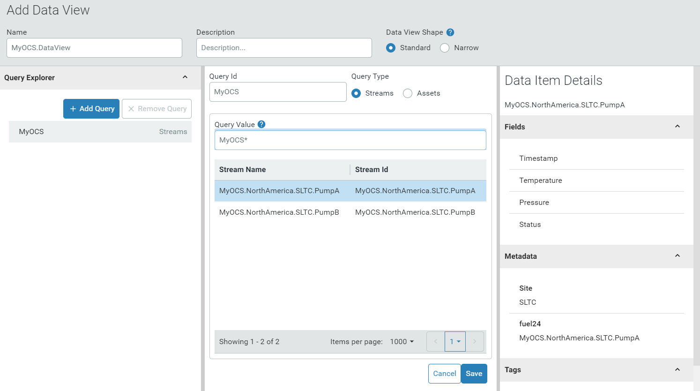

    

6. Click **Save** to save the data view and open the <!--`Configure Data View` --> next page where you configure the data view.

    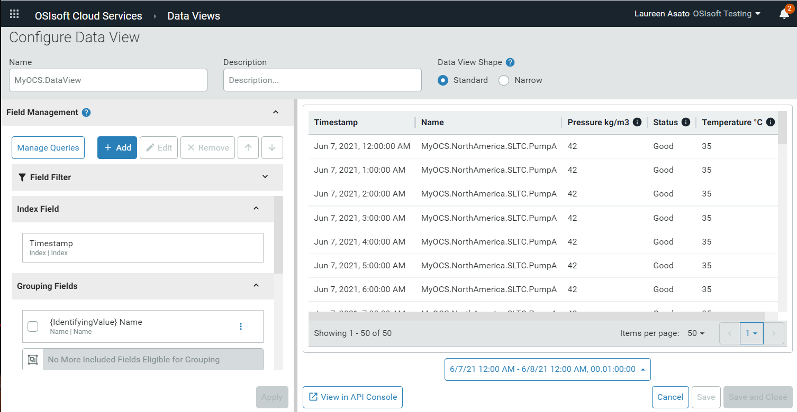

    A preview of your data view results appears in a table in the right pane: 

    - By default, the left most column is the property used to index your streams, in this example, Timestamp. 
    - The next column is Name, the name of the stream that contains the data displayed in this row.
    - The remaining columns are the value properties of the stream. The column name is the value property name, followed by the unit of measure, if applicable. In this example, the columns are named Pressure kg/m3, Status, and Temperature °C. 
    - Each row displays data for either the MyOCS.NorthAmerica.SLTC.PumpA stream or the MyOCS.NorthAmerica.SLTC.PumpB stream.

7. Click **Auto Refresh**.

    As you configure your data view in the left pane, the preview in the right pane automatically updates to reflect the choices you make.

###  Step 2: Change the data view shape

By changing the data view shape, you can create a consistent table format for your data views. This step describes how to display the minimum properties or the full set of properties.

1. In the upper pane, find the **Data View Shape** field. Click **Narrow**.

   The **Narrow** option removes all other columns from the table and displays only the following columns: Timestamp, Name, Field, and Value. The narrow data shape may be useful in ensuring a consistent table format for any data view. 

2. Click **Standard** before continuing to the next step. 

   To edit the query or add additional streams with another query, click **Manage Queries.** <!-- This returns you to the `Manage Queries` page. -->

3. After you are finished editing or adding a query, click **Apply** or **Cancel and Return** to return to the<!-- `Configure Data View`--> configuration page. 

### Step 3: Add data fields to the data view

In this step, you add the data fields to the data view and specify that the UOM is displayed.

1. In the left pane, click **Add** to open the `Add Data Fields` dialog.

   The fields for the MyOCS query are displayed.

1. Select the **Id** and **Site** checkboxes. 

    The number in the **Apply (2)** indicates the number of pending changes to the data fields and increments as you make additional changes.

3. The **Value** box indicates that the fields are filtered to display only value fields, and summary fields are not displayed. Click the **X** in the **Value** box to remove the filter.

    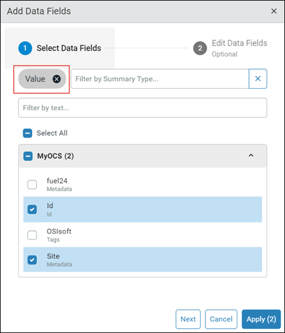

    The data fields list expands to include data summary options.

4. Select the **Pressure | Maximum** checkbox, and then click **Next** to go to the Edit Data Fields step.

    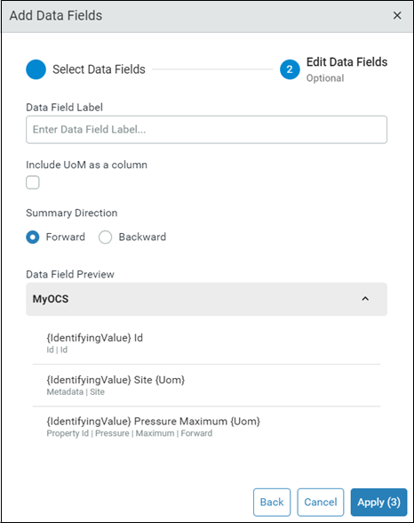

    In this step, you can give the column a user-friendly name, different from the field name in the source. You can select the **Include UoM as a column** checkbox to add a column for the UoM of each data field, if it is applicable. 

5. Click **Apply (3)** to add the three fields with the default options.

    Three new columns are added to the data view.

### Step 4: Remove data fields from the data view

In this step, you remove the Id field from the data view.

1. Select the **IdentifyingValue Id** checkbox under the MyOCS stream. 

1. Click the **More Options** menu and click **Remove**. 

     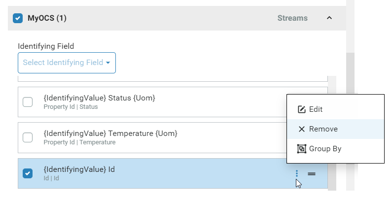

1. In the `Remove Data Fields` dialog, click **Remove**.

     The **Id** column is removed from the preview. 

### Step 5: Rename a column heading

In this procedure, you change the Site column label. Before you begin, scroll through the preview and locate the Site column.

1. Select the **IdentifyingValue Site UoM** checkbox under the MyOCS stream.

1. Click the **More Options** menu, and click **Edit** to open the `Edit Data Fields` dialog.

1. In the `Data Field Label` field, enter **{IdentifyingValue} City**.

1. (Optional) Select the **Include UoM as a column** checkbox to add a column with the UoM for the data field.

1. Click **Apply**. 

    The column heading changes from *Site* to *City* and a City Uom column is added to the preview.

### Step 6: Add stream names to the column headings

Notice the number of rows in the data view preview displayed at the bottom of the table. 

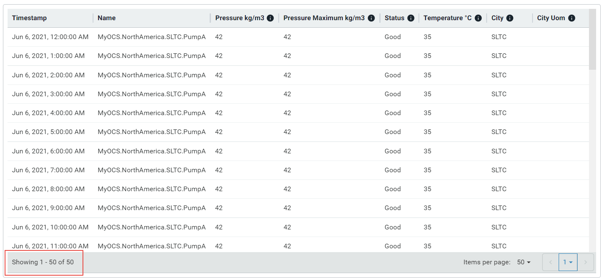

In this step, you remove the grouping field and decrease the total number of rows in the view. Then you add an `Id` field name to the column labels, making it easier to identify the stream associated with the data.

1. In the **Grouping Fields** section in the left pane, select the **IdentifyingValue Name** checkbox. 

1. Click the **More Options** menu, and click **Ungroup Field > All Eligible Queries**.

    <!-- This screen capture is probably not entirely necessary, but it's fun to create. -->

    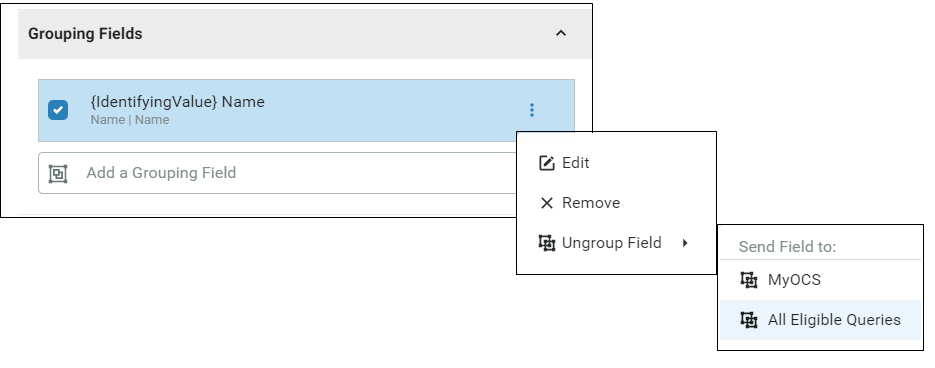

    The data preview is changed in the following way:

    -  The number of rows is reduced. There is one row, rather than multiple rows, for each timestamp.

    - Each row includes data for both streams. Each column label has a number appended to it. This distinguishes columns with the same labels, for example, Name.7 and Name.14.

      

      While this format reduces the number of rows, it makes it difficult to use because it is not clear which stream is associated with the column's data.

1. In the **Streams** section, click the **Identifying Field** dropdown list and click **Id | Id**. 

    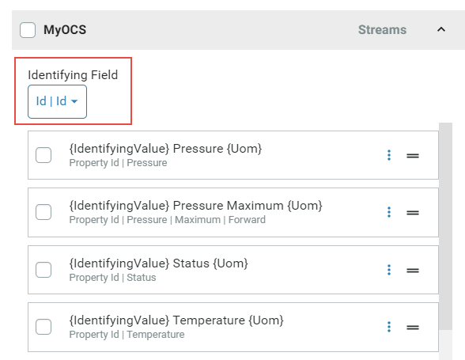

The column labels are prepended with the stream name. In the screen capture below, the *Name* column is prepended with the stream name *MyOCS.NorthAmerica.SLTC.PumpB*. 

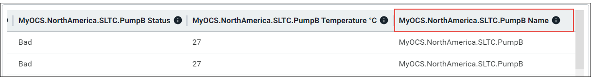

By default, data views are grouped by the stream name. However, if no grouping field is used, appending an identifying label to the column labels makes it easier to see which columns are associated with which stream. 

### Step 7: Change the order of the fields

In this step, you reorder the fields in the data view. 

1. In the **MyOCS** section, click the **IdentifyingValue City** field. 

2. Click the in the toolbar until the field is moved to the top of the list.

    The Site column is moved to the left side of the table, following the Timestamp column.

### Step 8: Specify the data view time range 

The time range for the data in the table is displayed below the preview.

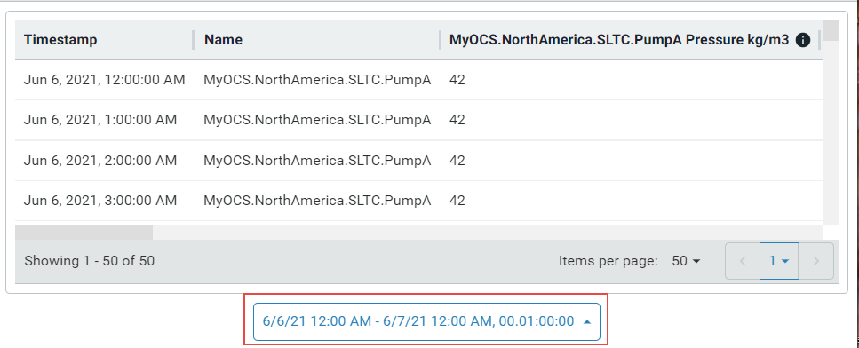

In this step, you set a default time range for the data view.

1. (Optional) Click the time range button to open the dialog where you can set the **Start Index (Local)**, **End Index (Local)**, and **Time Interval**. 

    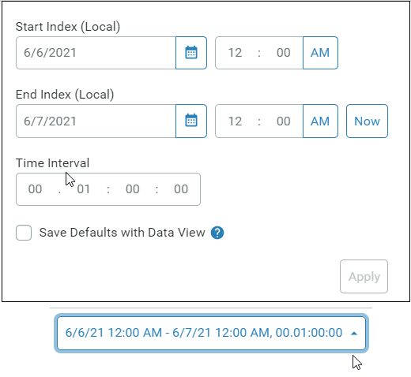

    The following describes how the time range settings are used with data view queries:

    - When you execute a data query, you must specify a start index, end index, and interpolation interval. If this is not specified, the data query results in an error.

    - Save the time range settings by selecting **Save Defaults with Data View**. These saved settings are used, by default, when you execute a query that does not specify a time range and interval.

    - You can override any defaults before the data view query is executed. 

1. Explore the different options to display your data. When you are satisfied with the data view preview, click **Save**. 

    This returns you to the Data Views page where you can execute your data view.
    
    ## Next step
    
    [Get started with stream views](xref:gsStreamviews)

