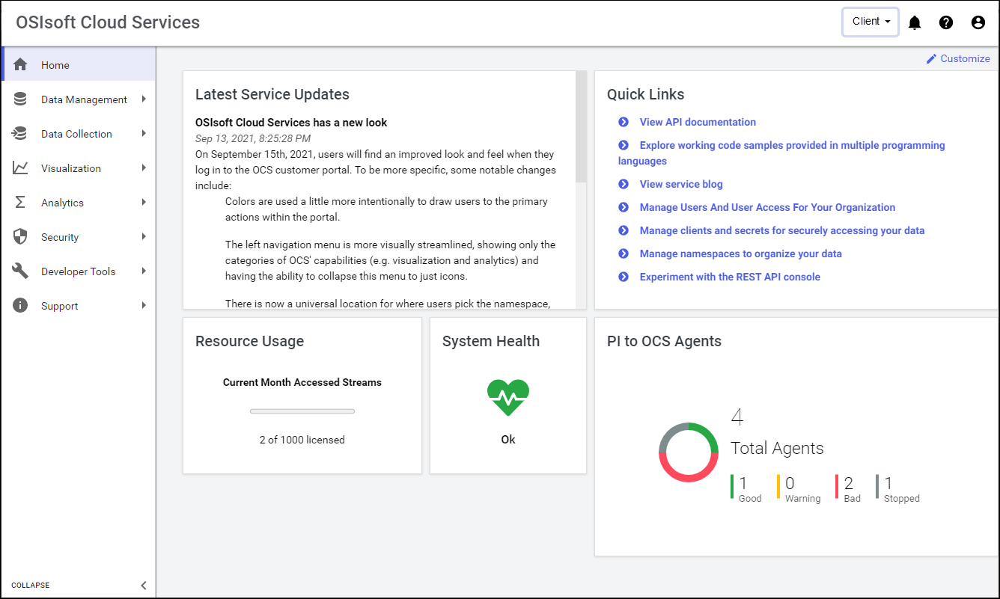
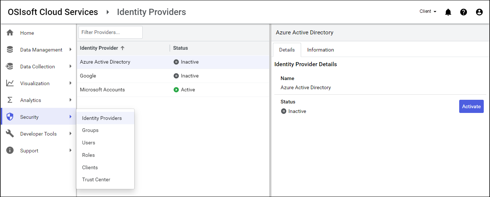
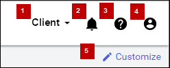

# Introduction to the OCS portal

Access and interact with OCS through the web-based portal. When you first access the OCS portal, several panes provide information about the system's health as well as quick links to popular documentation topics.

<!--Angela Flores 6/23/21 - This screenshot has a stray tool tip from another application. It needs to be cleaned up. --> <!--Victoria Touati 8/4/21 - Screenshot replaced & published to Zoomin. -->

## OCS features

The left pane contains a collapsable menu. Click a menu item to expand a section and access OCS features. Click the **COLLAPSE** chevrons at the bottom of the menu to collapse or expand the menu to show only icons or view both text and icons. <!--Angela Flores 6/23/21 - I would take the feature menu screenshot out. The list below explains the contents. Given the rapid pace of development, this screenshot is always going to be out-of-date. --><!--VTT 9/20/21 - Removed feature menu screenshot for rebranding.-->

OCS includes the following features:

- **Data Management**: Provides tools for setting up basic capabilities of OCS, including tenants, the Sequential Data Store (SDS), and metadata rules for data streams.
- **Data Collection**: Provides the ability to bring data from multiple sources and systems into a OCS namespace.
- **Visualization**: Allows you to view data trends and use assets to set up digital twins of real-world physical entities. <!--Angela Flores 6/23/21 - this is the only place in the documentation that uses the phrase "digital twins of real-world physical entities". What feature is that trying to describe? The only thing in the Visualization portion of the documentation is Trend. -->
- **Analytics**: Provides tools for shaping and querying large datasets.
- **Security**: Allows you to specify identity providers for authentication and add groups, users, roles, and clients to your tenant.
- **Developer Tools**: Provides code samples, an API console, and an editor for the OSIsoft Message Format (OMF).
- **Support**: Provides access to documentation, logs, support links, the OCS blog, and other useful information.

## Feature pages

Clicking a menu item takes you to the related feature page.

Most pages consist of two panes:

- The left pane is where you perform the tasks associated with the OCS resource. For example, the left pane is where you add and edit the OCS resource or manage its permissions.
- The right pane has one or more tabs:
  - The Details tab contains additional information about the selected resource.
  - The Information tab appears in some windows and provides documentation about the current feature and how to perform relevant tasks.
  - Some resources have additional panes for other configuration tasks.

## Top right of portal

There are several icons and links at the top right of the portal.

The table below provides a list and description of these items.

| Numbered Item/Name | Function |
|---------------|----------|
| 1 - Namespace |Lists and allows you to change the current namespace. |
| 2 - View Notifications icon |Click to view  OCS-generated notifications. | 
| 3 - Question mark icon | Click to access online documentation. |
| 4 - User profile icon  | Click to view a dropdown menu of the following: The currently logged in user, tenant details, resource usage, feedback page, and sign out of the portal. |
| 5 - Customize link | Click to customize the layout of the OCS portal home page. |
